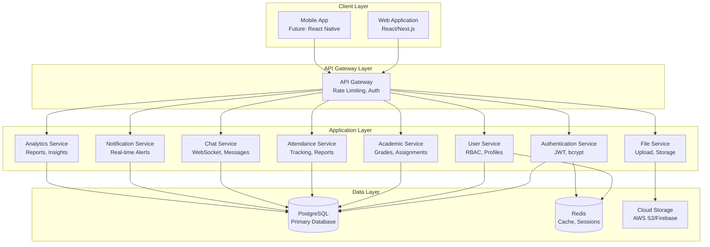

## Architecture

### System Architecture Diagram



### Architectural Layers

**1. Client Layer**
- Responsive web application built with React/Next.js
- State management using React Query for server state
- WebSocket client for real-time updates
- Routing and navigation
- Form validation and error handling

**2. API Gateway Layer**
- Request routing to appropriate services
- Authentication middleware (JWT validation)
- Rate limiting middleware
- Request logging and monitoring
- CORS configuration

**3. Application Layer (Microservices-style organization)**
- **Authentication Service**: User registration, login, token management
- **User Service**: Profile management, RBAC, role assignment
- **Academic Service**: Grades, assignments, tests, subjects
- **Attendance Service**: Attendance marking, QR codes, reports
- **Chat Service**: Real-time messaging, chat history
- **Notification Service**: Event-driven notifications, delivery
- **Analytics Service**: Data aggregation, report generation, insights
- **File Service**: File upload, cloud storage integration, URL generation

**4. Data Layer**
- PostgreSQL for persistent relational data
- Redis for caching frequently accessed data and session storage
- Cloud storage (AWS S3/Firebase) for files

### Communication Patterns

**REST API**: Synchronous request-response for CRUD operations
- GET /api/students - Retrieve student list
- POST /api/assignments - Create new assignment
- PUT /api/grades/:id - Update grade
- DELETE /api/users/:id - Delete user

**WebSocket**: Bidirectional real-time communication
- Chat messages
- Notifications
- Live attendance updates
- Real-time grade posting

**Event-Driven**: Asynchronous event processing
- Grade posted → Notify student and parent
- Assignment due → Send reminder
- Attendance marked absent → Alert parent


## Components and Interfaces

### Authentication Service

**Responsibilities:**
- User registration with email/phone validation
- Password hashing using bcrypt (cost factor 10)
- JWT token generation (access + refresh tokens)
- Token validation and refresh
- Rate limiting for login attempts
- Account lockout after failed attempts

**Key Functions:**

```typescript
interface AuthService {
  register(data: RegisterDTO): Promise<UserResponse>
  login(credentials: LoginDTO): Promise<AuthTokens>
  refreshToken(refreshToken: string): Promise<AuthTokens>
  logout(userId: string): Promise<void>
  validateToken(token: string): Promise<TokenPayload>
  resetPassword(email: string): Promise<void>
}

interface RegisterDTO {
  email?: string
  phone?: string
  password: string
  role: UserRole
  firstName: string
  lastName: string
}

interface LoginDTO {
  identifier: string // email or phone
  password: string
}

interface AuthTokens {
  accessToken: string  // 15 min expiry
  refreshToken: string // 7 day expiry
  user: UserResponse
}

interface TokenPayload {
  userId: string
  role: UserRole
  iat: number
  exp: number
}
```

**Security Measures:**
- Password validation: minimum 8 characters, uppercase, lowercase, number
- bcrypt hashing with salt rounds = 10
- JWT secret stored in environment variables
- Rate limiting: 5 failed attempts → 30 min lockout
- Token blacklisting on logout (stored in Redis)

### User Service

**Responsibilities:**
- User profile management (CRUD)
- Role-based access control enforcement
- Parent-child relationship management
- User search and filtering
- Profile updates and validation

**Key Functions:**

```typescript
interface UserService {
  createUser(data: CreateUserDTO): Promise<User>
  getUserById(id: string): Promise<User>
  updateUser(id: string, data: UpdateUserDTO): Promise<User>
  deleteUser(id: string): Promise<void>
  getUsersByRole(role: UserRole): Promise<User[]>
  searchUsers(query: string, filters: UserFilters): Promise<User[]>
  linkParentToChild(parentId: string, childId: string): Promise<void>
  checkPermission(userId: string, resource: string, action: string): Promise<boolean>
}

enum UserRole {
  STUDENT = 'STUDENT',
  TEACHER = 'TEACHER',
  PARENT = 'PARENT',
  ADMIN = 'ADMIN'
}

interface User {
  id: string
  email?: string
  phone?: string
  passwordHash: string
  role: UserRole
  firstName: string
  lastName: string
  isActive: boolean
  createdAt: Date
  updatedAt: Date
}

interface UserFilters {
  role?: UserRole
  isActive?: boolean
  createdAfter?: Date
  createdBefore?: Date
}
```

**RBAC Implementation:**
- Permission matrix stored in database
- Middleware checks permissions before route access
- Parents can only access their linked children's data
- Teachers can only access students in their subjects
- Admins have full access

### Academic Service

**Responsibilities:**
- Subject and class management
- Grade entry, editing, and calculation
- Assignment creation and submission
- Test creation and grading
- Learning plan management
- Progress tracking and analytics

**Key Functions:**

```typescript
interface AcademicService {
  // Subjects
  createSubject(data: CreateSubjectDTO): Promise<Subject>
  getSubjectsByStudent(studentId: string): Promise<Subject[]>
  
  // Grades
  createGrade(data: CreateGradeDTO): Promise<Grade>
  updateGrade(id: string, data: UpdateGradeDTO): Promise<Grade>
  getGradesByStudent(studentId: string): Promise<Grade[]>
  calculateAverageGrade(studentId: string, subjectId?: string): Promise<number>
  
  // Assignments
  createAssignment(data: CreateAssignmentDTO): Promise<Assignment>
  submitAssignment(assignmentId: string, studentId: string, files: File[]): Promise<Submission>
  gradeSubmission(submissionId: string, grade: number, feedback: string): Promise<Submission>
  getAssignmentsByStudent(studentId: string): Promise<Assignment[]>
  
  // Tests
  createTest(data: CreateTestDTO): Promise<Test>
  submitTest(testId: string, studentId: string, answers: Answer[]): Promise<TestResult>
  getTestResults(studentId: string): Promise<TestResult[]>
  
  // Learning Plans
  createLearningPlan(studentId: string, data: LearningPlanDTO): Promise<LearningPlan>
  updateLearningPlanProgress(planId: string, milestoneId: string, completed: boolean): Promise<LearningPlan>
}

interface Subject {
  id: string
  name: string
  description: string
  gradeLevel: number
  teacherId: string
  createdAt: Date
}

interface Grade {
  id: string
  studentId: string
  subjectId: string
  assignmentId?: string
  testId?: string
  value: number // 0-100
  teacherId: string
  createdAt: Date
  updatedAt: Date
}

interface Assignment {
  id: string
  title: string
  description: string
  subjectId: string
  teacherId: string
  dueDate: Date
  maxPoints: number
  attachments: string[] // URLs
  createdAt: Date
}

interface Submission {
  id: string
  assignmentId: string
  studentId: string
  files: string[] // URLs
  submittedAt: Date
  grade?: number
  feedback?: string
  gradedAt?: Date
}

interface Test {
  id: string
  title: string
  subjectId: string
  teacherId: string
  timeLimit: number // minutes
  passingScore: number
  questions: Question[]
  scheduledFor: Date
  createdAt: Date
}

interface Question {
  id: string
  text: string
  type: 'MULTIPLE_CHOICE' | 'TRUE_FALSE' | 'SHORT_ANSWER'
  options?: string[]
  correctAnswer: string | string[]
  points: number
}

interface TestResult {
  id: string
  testId: string
  studentId: string
  answers: Answer[]
  score: number
  maxScore: number
  submittedAt: Date
}

interface Answer {
  questionId: string
  answer: string | string[]
}

interface LearningPlan {
  id: string
  studentId: string
  goals: Goal[]
  createdBy: string
  createdAt: Date
  updatedAt: Date
}

interface Goal {
  id: string
  description: string
  milestones: Milestone[]
  targetDate: Date
}

interface Milestone {
  id: string
  description: string
  completed: boolean
  completedAt?: Date
}
```

**Business Logic:**
- Grade validation: 0-100 range
- Assignment due date must be future date
- Test auto-submission when time limit expires
- Automatic grade calculation for objective questions
- Progress calculation based on completed milestones


### Attendance Service

**Responsibilities:**
- Manual attendance marking
- QR code generation and validation
- Attendance record management
- Daily and monthly report generation
- Attendance statistics calculation

**Key Functions:**

```typescript
interface AttendanceService {
  markAttendance(data: MarkAttendanceDTO): Promise<AttendanceRecord>
  generateQRCode(classId: string, sessionDate: Date): Promise<QRCodeData>
  scanQRCode(qrCode: string, studentId: string): Promise<AttendanceRecord>
  getAttendanceByStudent(studentId: string, dateRange: DateRange): Promise<AttendanceRecord[]>
  getDailyReport(date: Date, classId?: string): Promise<AttendanceReport>
  getMonthlyReport(month: number, year: number, studentId?: string): Promise<AttendanceReport>
  calculateAttendanceRate(studentId: string, dateRange: DateRange): Promise<number>
}

interface MarkAttendanceDTO {
  studentId: string
  subjectId: string
  date: Date
  status: AttendanceStatus
  markedBy: string
}

enum AttendanceStatus {
  PRESENT = 'PRESENT',
  ABSENT = 'ABSENT',
  LATE = 'LATE',
  EXCUSED = 'EXCUSED'
}

interface AttendanceRecord {
  id: string
  studentId: string
  subjectId: string
  date: Date
  status: AttendanceStatus
  markedBy: string
  markedAt: Date
  qrCodeUsed: boolean
}

interface QRCodeData {
  code: string
  classId: string
  sessionDate: Date
  expiresAt: Date
  isActive: boolean
}

interface AttendanceReport {
  period: string
  totalSessions: number
  presentCount: number
  absentCount: number
  lateCount: number
  excusedCount: number
  attendanceRate: number
  studentBreakdown?: StudentAttendanceSummary[]
}

interface StudentAttendanceSummary {
  studentId: string
  studentName: string
  presentCount: number
  absentCount: number
  lateCount: number
  attendanceRate: number
}

interface DateRange {
  startDate: Date
  endDate: Date
}
```

**QR Code Logic:**
- Generate unique QR code for each class session
- QR code expires 15 minutes after class start time
- Scanning expired QR code marks student as late
- QR code contains encrypted session data (classId, date, timestamp)
- One-time use per student per session

### Chat Service

**Responsibilities:**
- Real-time message delivery via WebSocket
- Chat history storage and retrieval
- One-on-one and group chat support
- Message read status tracking
- Chat participant management

**Key Functions:**

```typescript
interface ChatService {
  sendMessage(data: SendMessageDTO): Promise<ChatMessage>
  getChatHistory(chatId: string, pagination: Pagination): Promise<ChatMessage[]>
  createChat(participants: string[], type: ChatType): Promise<Chat>
  markMessageAsRead(messageId: string, userId: string): Promise<void>
  getUnreadCount(userId: string): Promise<number>
  getUserChats(userId: string): Promise<Chat[]>
}

interface SendMessageDTO {
  chatId: string
  senderId: string
  content: string
  attachments?: string[]
}

interface ChatMessage {
  id: string
  chatId: string
  senderId: string
  content: string
  attachments: string[]
  sentAt: Date
  readBy: string[]
}

interface Chat {
  id: string
  type: ChatType
  participants: string[]
  createdAt: Date
  lastMessageAt: Date
}

enum ChatType {
  ONE_ON_ONE = 'ONE_ON_ONE',
  GROUP = 'GROUP'
}

interface Pagination {
  page: number
  limit: number
}
```

**WebSocket Events:**
- `message:send` - Send new message
- `message:received` - Receive new message
- `message:read` - Mark message as read
- `typing:start` - User started typing
- `typing:stop` - User stopped typing
- `user:online` - User came online
- `user:offline` - User went offline

### Notification Service

**Responsibilities:**
- Event-driven notification creation
- Real-time notification delivery via WebSocket
- Notification storage and retrieval
- User notification preferences management
- Notification batching for digests

**Key Functions:**

```typescript
interface NotificationService {
  createNotification(data: CreateNotificationDTO): Promise<Notification>
  sendNotification(notification: Notification): Promise<void>
  getUserNotifications(userId: string, filters: NotificationFilters): Promise<Notification[]>
  markAsRead(notificationId: string): Promise<void>
  markAllAsRead(userId: string): Promise<void>
  updatePreferences(userId: string, preferences: NotificationPreferences): Promise<void>
  getUnreadCount(userId: string): Promise<number>
}

interface CreateNotificationDTO {
  recipientId: string
  type: NotificationType
  title: string
  message: string
  data?: Record<string, any>
  priority: NotificationPriority
}

enum NotificationType {
  GRADE_POSTED = 'GRADE_POSTED',
  ASSIGNMENT_DUE = 'ASSIGNMENT_DUE',
  MESSAGE_RECEIVED = 'MESSAGE_RECEIVED',
  ATTENDANCE_MARKED = 'ATTENDANCE_MARKED',
  COMMENT_ADDED = 'COMMENT_ADDED',
  BADGE_EARNED = 'BADGE_EARNED',
  GRADE_DROP = 'GRADE_DROP',
  HOMEWORK_MISSED = 'HOMEWORK_MISSED',
  LOW_ATTENDANCE = 'LOW_ATTENDANCE'
}

enum NotificationPriority {
  LOW = 'LOW',
  MEDIUM = 'MEDIUM',
  HIGH = 'HIGH',
  URGENT = 'URGENT'
}

interface Notification {
  id: string
  recipientId: string
  type: NotificationType
  title: string
  message: string
  data?: Record<string, any>
  priority: NotificationPriority
  isRead: boolean
  createdAt: Date
  readAt?: Date
}

interface NotificationFilters {
  isRead?: boolean
  type?: NotificationType
  priority?: NotificationPriority
  dateRange?: DateRange
}

interface NotificationPreferences {
  email: boolean
  inApp: boolean
  sms: boolean
  digestFrequency: 'IMMEDIATE' | 'DAILY' | 'WEEKLY'
  enabledTypes: NotificationType[]
}
```

**Notification Triggers:**
- Grade posted → Notify student and parent
- Assignment created → Notify enrolled students
- Assignment due in 24h → Remind student
- Attendance marked absent → Alert parent immediately
- Grade drops >10% → Alert parent
- Comment added → Notify student and parent
- Badge earned → Notify student


### Analytics Service

**Responsibilities:**
- Data aggregation and statistical analysis
- Report generation (weekly, monthly, custom)
- Trend analysis and predictions
- Weak subject identification
- Performance comparison (student vs class average)
- Automatic recommendations based on patterns

**Key Functions:**

```typescript
interface AnalyticsService {
  getStudentAnalytics(studentId: string, dateRange: DateRange): Promise<StudentAnalytics>
  getClassAnalytics(classId: string, dateRange: DateRange): Promise<ClassAnalytics>
  getSubjectAnalytics(subjectId: string, dateRange: DateRange): Promise<SubjectAnalytics>
  identifyWeakSubjects(studentId: string): Promise<WeakSubject[]>
  generateWeeklyReport(userId: string): Promise<Report>
  generateMonthlyReport(userId: string): Promise<Report>
  getGradeTrends(studentId: string, subjectId?: string): Promise<TrendData>
  getRecommendations(studentId: string): Promise<Recommendation[]>
  exportReport(reportId: string, format: 'PDF' | 'EXCEL'): Promise<Buffer>
}

interface StudentAnalytics {
  studentId: string
  period: DateRange
  averageGrade: number
  gradeBySubject: SubjectGrade[]
  attendanceRate: number
  assignmentCompletionRate: number
  testAverageScore: number
  improvementRate: number // percentage change from previous period
  ranking: number // position in class
  totalStudentsInClass: number
}

interface SubjectGrade {
  subjectId: string
  subjectName: string
  averageGrade: number
  trend: 'IMPROVING' | 'DECLINING' | 'STABLE'
  comparisonToClassAverage: number // difference in percentage
}

interface ClassAnalytics {
  classId: string
  period: DateRange
  averageGrade: number
  attendanceRate: number
  totalStudents: number
  topPerformers: StudentSummary[]
  strugglingStudents: StudentSummary[]
  subjectPerformance: SubjectPerformance[]
}

interface SubjectPerformance {
  subjectId: string
  subjectName: string
  averageGrade: number
  passRate: number
  failRate: number
}

interface SubjectAnalytics {
  subjectId: string
  period: DateRange
  averageGrade: number
  totalStudents: number
  gradeDistribution: GradeDistribution
  attendanceRate: number
  assignmentCompletionRate: number
}

interface GradeDistribution {
  A: number // 90-100
  B: number // 80-89
  C: number // 70-79
  D: number // 60-69
  F: number // 0-59
}

interface WeakSubject {
  subjectId: string
  subjectName: string
  averageGrade: number
  trend: 'DECLINING' | 'CONSISTENTLY_LOW'
  recommendedActions: string[]
}

interface Report {
  id: string
  userId: string
  type: 'WEEKLY' | 'MONTHLY' | 'CUSTOM'
  period: DateRange
  summary: string
  keyMetrics: KeyMetric[]
  charts: ChartData[]
  recommendations: Recommendation[]
  generatedAt: Date
}

interface KeyMetric {
  name: string
  value: number | string
  change: number // percentage change from previous period
  trend: 'UP' | 'DOWN' | 'STABLE'
}

interface ChartData {
  type: 'LINE' | 'BAR' | 'PIE'
  title: string
  data: any[]
  labels: string[]
}

interface Recommendation {
  type: 'IMPROVEMENT' | 'WARNING' | 'PRAISE'
  subject?: string
  message: string
  priority: 'LOW' | 'MEDIUM' | 'HIGH'
  actionItems: string[]
}

interface TrendData {
  dataPoints: DataPoint[]
  trendLine: 'UPWARD' | 'DOWNWARD' | 'FLAT'
  projectedNextValue: number
}

interface DataPoint {
  date: Date
  value: number
}

interface StudentSummary {
  studentId: string
  studentName: string
  averageGrade: number
}
```

**Analytics Algorithms:**
- Weak subject identification: average < 70% or declining trend over 3 weeks
- Trend calculation: linear regression on grade data points
- Recommendations: rule-based system analyzing patterns
  - Grade drop >10% → "Focus on [subject], consider tutoring"
  - Attendance <85% → "Improve attendance to avoid falling behind"
  - Assignment completion <80% → "Complete homework regularly"
- Performance comparison: student grade vs class average

### File Service

**Responsibilities:**
- File upload handling and validation
- Cloud storage integration (AWS S3 or Firebase)
- Signed URL generation for secure access
- File metadata management
- File cleanup and orphan removal

**Key Functions:**

```typescript
interface FileService {
  uploadFile(file: File, metadata: FileMetadata): Promise<FileRecord>
  deleteFile(fileId: string): Promise<void>
  getFileUrl(fileId: string, expiresIn: number): Promise<string>
  getFilesByEntity(entityType: string, entityId: string): Promise<FileRecord[]>
  cleanupOrphanedFiles(): Promise<number>
}

interface FileMetadata {
  entityType: 'ASSIGNMENT' | 'SUBMISSION' | 'PROFILE' | 'CHAT'
  entityId: string
  uploadedBy: string
  fileName: string
  fileSize: number
  mimeType: string
}

interface FileRecord {
  id: string
  fileName: string
  fileSize: number
  mimeType: string
  storageKey: string // S3 key or Firebase path
  entityType: string
  entityId: string
  uploadedBy: string
  uploadedAt: Date
}

interface File {
  buffer: Buffer
  originalName: string
  mimeType: string
  size: number
}
```

**File Validation:**
- Allowed types: PDF, DOC, DOCX, PPT, PPTX, JPG, PNG, MP4, MOV
- Maximum size: 50MB for teachers, 10MB for students
- Virus scanning (optional, using ClamAV or cloud service)
- File name sanitization

**Storage Strategy:**
- Organize by entity type and date: `assignments/2024/01/file.pdf`
- Generate unique storage keys using UUID
- Signed URLs with 1-hour expiration for security
- Automatic cleanup of files not linked to entities (weekly job)

### Gamification Service

**Responsibilities:**
- Badge definition and awarding
- Experience points calculation
- Level progression management
- Leaderboard generation
- Achievement tracking

**Key Functions:**

```typescript
interface GamificationService {
  awardBadge(studentId: string, badgeType: BadgeType): Promise<Badge>
  addExperiencePoints(studentId: string, points: number, reason: string): Promise<void>
  getStudentGamificationStatus(studentId: string): Promise<GamificationStatus>
  getLeaderboard(classId: string, limit: number): Promise<LeaderboardEntry[]>
  checkAndAwardAchievements(studentId: string): Promise<Badge[]>
}

enum BadgeType {
  PERFECT_ATTENDANCE_WEEK = 'PERFECT_ATTENDANCE_WEEK',
  PERFECT_ATTENDANCE_MONTH = 'PERFECT_ATTENDANCE_MONTH',
  A_PLUS_STUDENT = 'A_PLUS_STUDENT',
  ASSIGNMENT_STREAK_5 = 'ASSIGNMENT_STREAK_5',
  ASSIGNMENT_STREAK_10 = 'ASSIGNMENT_STREAK_10',
  TOP_PERFORMER = 'TOP_PERFORMER',
  MOST_IMPROVED = 'MOST_IMPROVED',
  EARLY_BIRD = 'EARLY_BIRD'
}

interface Badge {
  id: string
  studentId: string
  type: BadgeType
  name: string
  description: string
  iconUrl: string
  earnedAt: Date
}

interface GamificationStatus {
  studentId: string
  level: number
  experiencePoints: number
  pointsToNextLevel: number
  badges: Badge[]
  currentStreak: number
  longestStreak: number
  ranking: number
}

interface LeaderboardEntry {
  rank: number
  studentId: string
  studentName: string
  level: number
  experiencePoints: number
  badgeCount: number
}
```

**Experience Points System:**
- Assignment submitted on time: +10 points
- Assignment submitted early: +15 points
- Test score >90%: +20 points
- Perfect attendance week: +25 points
- Helping other students (teacher awarded): +30 points

**Level Progression:**
- Level 1: 0-100 XP
- Level 2: 101-250 XP
- Level 3: 251-500 XP
- Level N: exponential growth formula


## Data Models

### Database Schema

The following Prisma schema defines the complete data model for EduTrack:

```prisma
// User and Authentication
model User {
  id            String    @id @default(uuid())
  email         String?   @unique
  phone         String?   @unique
  passwordHash  String
  role          UserRole
  firstName     String
  lastName      String
  isActive      Boolean   @default(true)
  createdAt     DateTime  @default(now())
  updatedAt     DateTime  @updatedAt
  
  studentProfile  StudentProfile?
  teacherProfile  TeacherProfile?
  parentProfile   ParentProfile?
  
  sentMessages      ChatMessage[]  @relation("SentMessages")
  notifications     Notification[]
  uploadedFiles     FileRecord[]
  markedAttendance  AttendanceRecord[] @relation("MarkedBy")
  
  @@index([email])
  @@index([phone])
  @@index([role])
}

enum UserRole {
  STUDENT
  TEACHER
  PARENT
  ADMIN
}

model StudentProfile {
  id              String   @id @default(uuid())
  userId          String   @unique
  user            User     @relation(fields: [userId], references: [id], onDelete: Cascade)
  studentId       String   @unique // School-assigned ID
  gradeLevel      Int
  enrollmentDate  DateTime @default(now())
  
  parents         ParentStudent[]
  enrollments     Enrollment[]
  grades          Grade[]
  submissions     Submission[]
  testResults     TestResult[]
  attendance      AttendanceRecord[]
  learningPlans   LearningPlan[]
  badges          Badge[]
  gamification    GamificationStatus?
  comments        TeacherComment[]
  
  @@index([gradeLevel])
}

model TeacherProfile {
  id              String   @id @default(uuid())
  userId          String   @unique
  user            User     @relation(fields: [userId], references: [id], onDelete: Cascade)
  teacherId       String   @unique
  specialization  String[]
  isApproved      Boolean  @default(false)
  approvedAt      DateTime?
  
  subjects        Subject[]
  assignments     Assignment[]
  tests           Test[]
  grades          Grade[]
  comments        TeacherComment[]
}

model ParentProfile {
  id        String   @id @default(uuid())
  userId    String   @unique
  user      User     @relation(fields: [userId], references: [id], onDelete: Cascade)
  
  children  ParentStudent[]
  
  preferences NotificationPreferences?
}

model ParentStudent {
  id        String   @id @default(uuid())
  parentId  String
  parent    ParentProfile @relation(fields: [parentId], references: [id], onDelete: Cascade)
  studentId String
  student   StudentProfile @relation(fields: [studentId], references: [id], onDelete: Cascade)
  
  relationship String // "mother", "father", "guardian"
  isPrimary    Boolean @default(false)
  createdAt    DateTime @default(now())
  
  @@unique([parentId, studentId])
  @@index([parentId])
  @@index([studentId])
}

// Academic Models
model Subject {
  id          String   @id @default(uuid())
  name        String
  description String
  gradeLevel  Int
  teacherId   String
  teacher     TeacherProfile @relation(fields: [teacherId], references: [id])
  isActive    Boolean  @default(true)
  createdAt   DateTime @default(now())
  
  enrollments Enrollment[]
  assignments Assignment[]
  tests       Test[]
  grades      Grade[]
  attendance  AttendanceRecord[]
  
  @@index([teacherId])
  @@index([gradeLevel])
}

model Enrollment {
  id        String   @id @default(uuid())
  studentId String
  student   StudentProfile @relation(fields: [studentId], references: [id], onDelete: Cascade)
  subjectId String
  subject   Subject @relation(fields: [subjectId], references: [id], onDelete: Cascade)
  enrolledAt DateTime @default(now())
  
  @@unique([studentId, subjectId])
  @@index([studentId])
  @@index([subjectId])
}

model Grade {
  id          String   @id @default(uuid())
  studentId   String
  student     StudentProfile @relation(fields: [studentId], references: [id], onDelete: Cascade)
  subjectId   String
  subject     Subject @relation(fields: [subjectId], references: [id])
  teacherId   String
  teacher     TeacherProfile @relation(fields: [teacherId], references: [id])
  assignmentId String?
  assignment  Assignment? @relation(fields: [assignmentId], references: [id])
  testId      String?
  test        Test? @relation(fields: [testId], references: [id])
  value       Float // 0-100
  createdAt   DateTime @default(now())
  updatedAt   DateTime @updatedAt
  
  @@index([studentId])
  @@index([subjectId])
  @@index([teacherId])
}

model Assignment {
  id          String   @id @default(uuid())
  title       String
  description String   @db.Text
  subjectId   String
  subject     Subject @relation(fields: [subjectId], references: [id])
  teacherId   String
  teacher     TeacherProfile @relation(fields: [teacherId], references: [id])
  dueDate     DateTime
  maxPoints   Int
  attachments String[] // File URLs
  createdAt   DateTime @default(now())
  updatedAt   DateTime @updatedAt
  
  submissions Submission[]
  grades      Grade[]
  
  @@index([subjectId])
  @@index([teacherId])
  @@index([dueDate])
}

model Submission {
  id          String   @id @default(uuid())
  assignmentId String
  assignment  Assignment @relation(fields: [assignmentId], references: [id], onDelete: Cascade)
  studentId   String
  student     StudentProfile @relation(fields: [studentId], references: [id], onDelete: Cascade)
  files       String[] // File URLs
  submittedAt DateTime @default(now())
  grade       Float?
  feedback    String?  @db.Text
  gradedAt    DateTime?
  
  @@unique([assignmentId, studentId])
  @@index([assignmentId])
  @@index([studentId])
}

model Test {
  id          String   @id @default(uuid())
  title       String
  subjectId   String
  subject     Subject @relation(fields: [subjectId], references: [id])
  teacherId   String
  teacher     TeacherProfile @relation(fields: [teacherId], references: [id])
  timeLimit   Int // minutes
  passingScore Float
  scheduledFor DateTime
  questions   Json // Array of Question objects
  createdAt   DateTime @default(now())
  
  results     TestResult[]
  grades      Grade[]
  
  @@index([subjectId])
  @@index([teacherId])
  @@index([scheduledFor])
}

model TestResult {
  id          String   @id @default(uuid())
  testId      String
  test        Test @relation(fields: [testId], references: [id], onDelete: Cascade)
  studentId   String
  student     StudentProfile @relation(fields: [studentId], references: [id], onDelete: Cascade)
  answers     Json // Array of Answer objects
  score       Float
  maxScore    Float
  submittedAt DateTime @default(now())
  
  @@unique([testId, studentId])
  @@index([testId])
  @@index([studentId])
}

model TeacherComment {
  id        String   @id @default(uuid())
  studentId String
  student   StudentProfile @relation(fields: [studentId], references: [id], onDelete: Cascade)
  teacherId String
  teacher   TeacherProfile @relation(fields: [teacherId], references: [id])
  subjectId String?
  content   String   @db.Text
  type      CommentType
  createdAt DateTime @default(now())
  
  @@index([studentId])
  @@index([teacherId])
}

enum CommentType {
  IMPROVEMENT
  STRENGTH
  GENERAL
  CONCERN
}

model LearningPlan {
  id        String   @id @default(uuid())
  studentId String
  student   StudentProfile @relation(fields: [studentId], references: [id], onDelete: Cascade)
  goals     Json // Array of Goal objects
  createdBy String
  createdAt DateTime @default(now())
  updatedAt DateTime @updatedAt
  
  @@index([studentId])
}

// Attendance Models
model AttendanceRecord {
  id          String   @id @default(uuid())
  studentId   String
  student     StudentProfile @relation(fields: [studentId], references: [id], onDelete: Cascade)
  subjectId   String
  subject     Subject @relation(fields: [subjectId], references: [id])
  date        DateTime
  status      AttendanceStatus
  markedBy    String
  marker      User @relation("MarkedBy", fields: [markedBy], references: [id])
  markedAt    DateTime @default(now())
  qrCodeUsed  Boolean  @default(false)
  
  @@unique([studentId, subjectId, date])
  @@index([studentId])
  @@index([subjectId])
  @@index([date])
}

enum AttendanceStatus {
  PRESENT
  ABSENT
  LATE
  EXCUSED
}

model QRCode {
  id          String   @id @default(uuid())
  code        String   @unique
  classId     String
  sessionDate DateTime
  expiresAt   DateTime
  isActive    Boolean  @default(true)
  createdAt   DateTime @default(now())
  
  @@index([code])
  @@index([expiresAt])
}

// Communication Models
model Chat {
  id            String   @id @default(uuid())
  type          ChatType
  participants  String[] // Array of user IDs
  createdAt     DateTime @default(now())
  lastMessageAt DateTime @default(now())
  
  messages      ChatMessage[]
  
  @@index([participants])
}

enum ChatType {
  ONE_ON_ONE
  GROUP
}

model ChatMessage {
  id          String   @id @default(uuid())
  chatId      String
  chat        Chat @relation(fields: [chatId], references: [id], onDelete: Cascade)
  senderId    String
  sender      User @relation("SentMessages", fields: [senderId], references: [id])
  content     String   @db.Text
  attachments String[]
  sentAt      DateTime @default(now())
  readBy      String[] // Array of user IDs
  
  @@index([chatId])
  @@index([senderId])
  @@index([sentAt])
}

model Notification {
  id          String   @id @default(uuid())
  recipientId String
  recipient   User @relation(fields: [recipientId], references: [id], onDelete: Cascade)
  type        NotificationType
  title       String
  message     String   @db.Text
  data        Json?
  priority    NotificationPriority
  isRead      Boolean  @default(false)
  createdAt   DateTime @default(now())
  readAt      DateTime?
  
  @@index([recipientId])
  @@index([isRead])
  @@index([createdAt])
}

enum NotificationType {
  GRADE_POSTED
  ASSIGNMENT_DUE
  MESSAGE_RECEIVED
  ATTENDANCE_MARKED
  COMMENT_ADDED
  BADGE_EARNED
  GRADE_DROP
  HOMEWORK_MISSED
  LOW_ATTENDANCE
}

enum NotificationPriority {
  LOW
  MEDIUM
  HIGH
  URGENT
}

model NotificationPreferences {
  id              String   @id @default(uuid())
  parentId        String   @unique
  parent          ParentProfile @relation(fields: [parentId], references: [id], onDelete: Cascade)
  email           Boolean  @default(true)
  inApp           Boolean  @default(true)
  sms             Boolean  @default(false)
  digestFrequency String   @default("IMMEDIATE") // IMMEDIATE, DAILY, WEEKLY
  enabledTypes    String[] // Array of NotificationType
  updatedAt       DateTime @updatedAt
}

// Gamification Models
model GamificationStatus {
  id                String   @id @default(uuid())
  studentId         String   @unique
  student           StudentProfile @relation(fields: [studentId], references: [id], onDelete: Cascade)
  level             Int      @default(1)
  experiencePoints  Int      @default(0)
  currentStreak     Int      @default(0)
  longestStreak     Int      @default(0)
  updatedAt         DateTime @updatedAt
}

model Badge {
  id          String   @id @default(uuid())
  studentId   String
  student     StudentProfile @relation(fields: [studentId], references: [id], onDelete: Cascade)
  type        String
  name        String
  description String
  iconUrl     String
  earnedAt    DateTime @default(now())
  
  @@index([studentId])
}

// File Management
model FileRecord {
  id          String   @id @default(uuid())
  fileName    String
  fileSize    Int
  mimeType    String
  storageKey  String   @unique
  entityType  String
  entityId    String
  uploadedBy  String
  uploader    User @relation(fields: [uploadedBy], references: [id])
  uploadedAt  DateTime @default(now())
  
  @@index([entityType, entityId])
  @@index([uploadedBy])
}

// Analytics and Reports
model Report {
  id          String   @id @default(uuid())
  userId      String
  type        ReportType
  period      Json // DateRange object
  summary     String   @db.Text
  data        Json // Report data
  generatedAt DateTime @default(now())
  
  @@index([userId])
  @@index([type])
}

enum ReportType {
  WEEKLY
  MONTHLY
  CUSTOM
}

// Session Management (for token blacklisting)
model TokenBlacklist {
  id        String   @id @default(uuid())
  token     String   @unique
  expiresAt DateTime
  createdAt DateTime @default(now())
  
  @@index([token])
  @@index([expiresAt])
}
```

### Database Indexes

Critical indexes for performance:
- User: email, phone, role
- StudentProfile: gradeLevel
- Grade: studentId, subjectId, teacherId
- Assignment: subjectId, teacherId, dueDate
- AttendanceRecord: studentId, subjectId, date
- Notification: recipientId, isRead, createdAt
- ChatMessage: chatId, senderId, sentAt

### Data Relationships

**One-to-One:**
- User ↔ StudentProfile
- User ↔ TeacherProfile
- User ↔ ParentProfile
- StudentProfile ↔ GamificationStatus

**One-to-Many:**
- TeacherProfile → Subject
- Subject → Assignment
- Assignment → Submission
- StudentProfile → Grade
- StudentProfile → Badge

**Many-to-Many:**
- ParentProfile ↔ StudentProfile (through ParentStudent)
- StudentProfile ↔ Subject (through Enrollment)


## Correctness Properties

*A property is a characteristic or behavior that should hold true across all valid executions of a system—essentially, a formal statement about what the system should do. Properties serve as the bridge between human-readable specifications and machine-verifiable correctness guarantees.*

### Property 1: User Registration with Valid Inputs Creates Account

*For any* valid email or phone number and password meeting security requirements, registering a new user should successfully create an account with hashed password and assigned role.

**Validates: Requirements 1.1, 1.5, 1.7**

### Property 2: Input Validation Rejects Invalid Formats

*For any* invalid email format, invalid phone format, or password not meeting security requirements (minimum 8 characters, uppercase, lowercase, number), the registration should be rejected with appropriate error message.

**Validates: Requirements 1.2, 1.3, 1.4**

### Property 3: Duplicate Registration Prevention

*For any* already registered email or phone number, attempting to register again with the same identifier should be rejected regardless of other field values.

**Validates: Requirements 1.6**

### Property 4: Authentication with Valid Credentials Succeeds

*For any* registered user with correct password, authentication should succeed and return both access token (15-minute expiry) and refresh token (7-day expiry).

**Validates: Requirements 2.1, 2.3, 2.4, 2.5**

### Property 5: Authentication with Invalid Credentials Fails

*For any* unregistered user or registered user with incorrect password, authentication should fail and return an error without generating tokens.

**Validates: Requirements 2.2**

### Property 6: Token Refresh Round Trip

*For any* valid refresh token, using it to obtain a new access token should succeed, and the new access token should be valid for authentication.

**Validates: Requirements 2.8**

### Property 7: Expired Token Rejection

*For any* expired access token, attempting to use it for API requests should be rejected with 401 Unauthorized status.

**Validates: Requirements 2.7**

### Property 8: Role-Based Access Control Enforcement

*For any* user with a specific role (Student, Teacher, Parent, Admin), attempting to access endpoints outside their role permissions should be rejected with 403 Forbidden, while accessing permitted endpoints should succeed.

**Validates: Requirements 4.1, 4.2, 4.3, 4.5**

### Property 9: Parent Data Isolation

*For any* parent user, requesting student data should only return data for children linked to that parent account, never for unlinked students.

**Validates: Requirements 4.4, 4.6, 20.1**

### Property 10: Student Subject Enrollment Retrieval

*For any* student enrolled in a set of subjects, requesting their subject list should return exactly those subjects and no others.

**Validates: Requirements 5.1**

### Property 11: Grade Retrieval Completeness

*For any* student with grades in multiple subjects, requesting their grades should return all grades across all enrolled subjects.

**Validates: Requirements 6.1, 6.2**

### Property 12: Grade Storage with Metadata

*For any* grade entered by a teacher, the stored grade record should include student ID, subject ID, grade value, teacher ID, and timestamp.

**Validates: Requirements 6.3**

### Property 13: Grade Average Calculation

*For any* set of grades for a student in a subject, the calculated average should equal the sum of grade values divided by the count of grades.

**Validates: Requirements 6.6**

### Property 14: GPA Calculation Across Subjects

*For any* student with grades in multiple subjects, the overall GPA should equal the average of all subject averages weighted equally.

**Validates: Requirements 6.7**

### Property 15: Grade Range Validation

*For any* grade entry attempt with value outside the range 0-100, the system should reject the entry with a validation error.

**Validates: Requirements 14.1**

### Property 16: Assignment Retrieval by Enrollment

*For any* student enrolled in specific subjects, requesting assignments should return only assignments for those enrolled subjects, not for other subjects.

**Validates: Requirements 7.2**

### Property 17: Assignment Submission Storage

*For any* assignment submission by a student, the stored submission should include assignment ID, student ID, submitted files, and submission timestamp.

**Validates: Requirements 7.4**

### Property 18: Overdue Assignment Detection

*For any* assignment with due date in the past and no submission from a student, the assignment status for that student should be marked as overdue.

**Validates: Requirements 7.5**

### Property 19: File Upload Validation

*For any* file upload with invalid type (not in allowed list) or size exceeding maximum (50MB for teachers, 10MB for students), the upload should be rejected with appropriate error.

**Validates: Requirements 7.8, 18.2**

### Property 20: Test Auto-Grading Accuracy

*For any* test with objective questions (multiple choice, true/false) and student answers, the calculated score should equal the sum of points for questions where the student's answer matches the correct answer.

**Validates: Requirements 8.3**

### Property 21: Progress Trend Calculation

*For any* student with grade history over time, the calculated trend (improving/declining/stable) should reflect the direction of grade changes using linear regression or similar method.

**Validates: Requirements 11.1**

### Property 22: Performance Change Percentage

*For any* student with grades in two time periods, the improvement or decline percentage should equal ((current_average - previous_average) / previous_average) * 100.

**Validates: Requirements 11.5**

### Property 23: Badge Award on Milestone Achievement

*For any* student meeting badge criteria (e.g., perfect attendance week, all grades >90%), the system should award the corresponding badge with timestamp.

**Validates: Requirements 12.1**

### Property 24: Level Progression on XP Threshold

*For any* student whose experience points reach or exceed the threshold for the next level, the system should increment their level.

**Validates: Requirements 12.3**

### Property 25: Bulk Grade Entry Atomicity

*For any* bulk grade entry operation for multiple students, either all grades should be stored successfully or none should be stored (all-or-nothing).

**Validates: Requirements 14.5**

### Property 26: Attendance Record Completeness

*For any* attendance marking operation, the stored record should include student ID, subject ID, date, status, marker ID, and timestamp.

**Validates: Requirements 17.1**

### Property 27: Attendance Percentage Calculation

*For any* student with attendance records over a period, the attendance percentage should equal (present_count + late_count) / total_sessions * 100.

**Validates: Requirements 17.7**

### Property 28: Institution-Wide Attendance Aggregation

*For any* set of attendance records across all students and subjects, the institution-wide attendance rate should equal the average of all individual student attendance rates.

**Validates: Requirements 23.7**

### Property 29: Struggling Subject Identification

*For any* student with subject average below 70% or declining trend over 3 weeks, that subject should be flagged as a struggling subject.

**Validates: Requirements 21.2**

### Property 30: Grade Drop Notification Trigger

*For any* student whose grade in a subject drops by more than 10% between two consecutive grading periods, a notification should be sent to the linked parent.

**Validates: Requirements 22.1**

### Property 31: Multi-Dimensional Grade Analysis

*For any* set of grades, calculating average by subject, class, and grade level should produce consistent results where class average equals the average of all student averages in that class.

**Validates: Requirements 24.1**

### Property 32: Recommendation Generation from Patterns

*For any* student with grade drop >10%, attendance <85%, or assignment completion <80%, the system should generate at least one recommendation addressing the identified issue.

**Validates: Requirements 24.6**

### Property 33: Language Preference Persistence

*For any* user who selects a language preference, that preference should be stored and applied to all subsequent sessions until changed.

**Validates: Requirements 31.2, 31.3**

### Property 34: Data Encryption at Rest

*For any* sensitive data (passwords, personal information) stored in the database, the stored value should be encrypted and not match the plaintext value.

**Validates: Requirements 36.1**

### Property 35: WebSocket Authentication Requirement

*For any* WebSocket connection attempt without a valid access token, the connection should be rejected before establishing the bidirectional channel.

**Validates: Requirements 37.2**

### Property 36: File Storage Unique Identifier

*For any* two files uploaded to the system, their generated storage identifiers should be unique (no collisions).

**Validates: Requirements 38.2**

### Property 37: Signed URL Expiration

*For any* file access request, the generated signed URL should have an expiration time of exactly 1 hour from generation time.

**Validates: Requirements 38.3**

### Property 38: Search Partial Matching

*For any* search query that is a substring of an entity name (student, subject, assignment), the search results should include that entity.

**Validates: Requirements 40.6**


## Error Handling

### Error Response Format

All API errors follow a consistent JSON structure:

```typescript
interface ErrorResponse {
  success: false
  error: {
    code: string
    message: string
    details?: any
    timestamp: string
    path: string
  }
}
```

### Error Categories

**1. Validation Errors (400 Bad Request)**
- Invalid input format (email, phone, password)
- Missing required fields
- Out-of-range values (grades, dates)
- File type or size violations

Example:
```json
{
  "success": false,
  "error": {
    "code": "VALIDATION_ERROR",
    "message": "Password must be at least 8 characters with uppercase, lowercase, and number",
    "details": { "field": "password" },
    "timestamp": "2024-01-15T10:30:00Z",
    "path": "/api/auth/register"
  }
}
```

**2. Authentication Errors (401 Unauthorized)**
- Invalid credentials
- Expired token
- Missing token
- Invalid token signature

Example:
```json
{
  "success": false,
  "error": {
    "code": "TOKEN_EXPIRED",
    "message": "Access token has expired. Please refresh your token.",
    "timestamp": "2024-01-15T10:30:00Z",
    "path": "/api/students"
  }
}
```

**3. Authorization Errors (403 Forbidden)**
- Insufficient permissions
- Role-based access denied
- Parent accessing non-linked child data

Example:
```json
{
  "success": false,
  "error": {
    "code": "FORBIDDEN",
    "message": "You do not have permission to access this resource",
    "details": { "required_role": "TEACHER", "user_role": "STUDENT" },
    "timestamp": "2024-01-15T10:30:00Z",
    "path": "/api/grades"
  }
}
```

**4. Not Found Errors (404 Not Found)**
- Resource does not exist
- Invalid ID

Example:
```json
{
  "success": false,
  "error": {
    "code": "NOT_FOUND",
    "message": "Student with ID 'abc123' not found",
    "timestamp": "2024-01-15T10:30:00Z",
    "path": "/api/students/abc123"
  }
}
```

**5. Conflict Errors (409 Conflict)**
- Duplicate registration
- Concurrent modification
- Business rule violation

Example:
```json
{
  "success": false,
  "error": {
    "code": "DUPLICATE_EMAIL",
    "message": "An account with this email already exists",
    "timestamp": "2024-01-15T10:30:00Z",
    "path": "/api/auth/register"
  }
}
```

**6. Rate Limit Errors (429 Too Many Requests)**
- Request rate exceeded
- Account temporarily locked

Example:
```json
{
  "success": false,
  "error": {
    "code": "RATE_LIMIT_EXCEEDED",
    "message": "Too many requests. Please try again in 60 seconds.",
    "details": { "retry_after": 60 },
    "timestamp": "2024-01-15T10:30:00Z",
    "path": "/api/auth/login"
  }
}
```

**7. Server Errors (500 Internal Server Error)**
- Database connection failure
- Unexpected exceptions
- Third-party service failures

Example:
```json
{
  "success": false,
  "error": {
    "code": "INTERNAL_ERROR",
    "message": "An unexpected error occurred. Please try again later.",
    "timestamp": "2024-01-15T10:30:00Z",
    "path": "/api/analytics/report"
  }
}
```

### Error Handling Strategy

**1. Input Validation**
- Validate all inputs at API boundary before processing
- Use schema validation libraries (Zod, Joi, class-validator)
- Return detailed validation errors to help users correct input

**2. Database Errors**
- Catch Prisma errors and translate to user-friendly messages
- Handle unique constraint violations gracefully
- Implement retry logic for transient failures
- Use database transactions for multi-step operations

**3. External Service Errors**
- Implement circuit breaker pattern for cloud storage
- Provide fallback behavior when services are unavailable
- Log external service failures for monitoring

**4. WebSocket Errors**
- Handle connection failures with automatic reconnection
- Implement exponential backoff for reconnection attempts
- Gracefully degrade to polling if WebSocket unavailable

**5. Logging and Monitoring**
- Log all errors with context (user ID, request ID, stack trace)
- Use structured logging (JSON format)
- Integrate with monitoring tools (Sentry, DataDog, CloudWatch)
- Alert on critical errors (authentication failures, database errors)

**6. User-Facing Error Messages**
- Never expose internal implementation details
- Provide actionable guidance ("Check your email format")
- Use appropriate language based on user's selected language
- Include support contact for unrecoverable errors


## Testing Strategy

### Dual Testing Approach

EduTrack employs a comprehensive testing strategy combining unit tests and property-based tests to ensure correctness and reliability.

**Unit Tests**: Verify specific examples, edge cases, and error conditions
**Property Tests**: Verify universal properties across all inputs using randomized testing

Together, these approaches provide comprehensive coverage where unit tests catch concrete bugs and property tests verify general correctness.

### Property-Based Testing

**Library Selection:**
- **JavaScript/TypeScript**: fast-check (recommended)
- **Alternative**: jsverify

**Configuration:**
- Minimum 100 iterations per property test (due to randomization)
- Each property test references its design document property
- Tag format: `// Feature: edutrack-platform, Property {number}: {property_text}`

**Example Property Test:**

```typescript
import fc from 'fast-check'
import { registerUser } from './auth-service'

describe('Authentication Service', () => {
  // Feature: edutrack-platform, Property 1: User Registration with Valid Inputs Creates Account
  it('should create account for any valid email and password', async () => {
    await fc.assert(
      fc.asyncProperty(
        fc.emailAddress(),
        fc.string({ minLength: 8 }).filter(pwd => 
          /[A-Z]/.test(pwd) && /[a-z]/.test(pwd) && /[0-9]/.test(pwd)
        ),
        fc.constantFrom('STUDENT', 'TEACHER', 'PARENT'),
        async (email, password, role) => {
          const result = await registerUser({ email, password, role })
          
          expect(result.success).toBe(true)
          expect(result.user.email).toBe(email)
          expect(result.user.role).toBe(role)
          expect(result.user.passwordHash).not.toBe(password) // hashed
        }
      ),
      { numRuns: 100 }
    )
  })
  
  // Feature: edutrack-platform, Property 2: Input Validation Rejects Invalid Formats
  it('should reject invalid email formats', async () => {
    await fc.assert(
      fc.asyncProperty(
        fc.string().filter(s => !s.includes('@')), // invalid email
        fc.string({ minLength: 8 }),
        async (invalidEmail, password) => {
          const result = await registerUser({ email: invalidEmail, password, role: 'STUDENT' })
          
          expect(result.success).toBe(false)
          expect(result.error.code).toBe('VALIDATION_ERROR')
        }
      ),
      { numRuns: 100 }
    )
  })
})
```

### Unit Testing

**Framework**: Jest (JavaScript/TypeScript)

**Coverage Areas:**

**1. Service Layer Tests**
- Test each service function with specific examples
- Mock database calls using Prisma mock
- Test error handling paths
- Verify business logic correctness

Example:
```typescript
describe('GradeService', () => {
  it('should calculate correct average for specific grades', async () => {
    const grades = [85, 90, 78, 92, 88]
    const average = await gradeService.calculateAverage(grades)
    expect(average).toBe(86.6)
  })
  
  it('should reject grade outside 0-100 range', async () => {
    await expect(
      gradeService.createGrade({ studentId: '1', value: 105 })
    ).rejects.toThrow('Grade must be between 0 and 100')
  })
})
```

**2. API Endpoint Tests**
- Test HTTP request/response handling
- Verify authentication middleware
- Test authorization checks
- Validate request/response schemas

Example:
```typescript
describe('POST /api/grades', () => {
  it('should create grade with valid teacher token', async () => {
    const token = generateTeacherToken()
    const response = await request(app)
      .post('/api/grades')
      .set('Authorization', `Bearer ${token}`)
      .send({ studentId: '1', subjectId: '1', value: 85 })
    
    expect(response.status).toBe(201)
    expect(response.body.grade.value).toBe(85)
  })
  
  it('should reject grade creation with student token', async () => {
    const token = generateStudentToken()
    const response = await request(app)
      .post('/api/grades')
      .set('Authorization', `Bearer ${token}`)
      .send({ studentId: '1', subjectId: '1', value: 85 })
    
    expect(response.status).toBe(403)
  })
})
```

**3. Database Integration Tests**
- Test Prisma queries with test database
- Verify relationships and cascades
- Test transaction handling
- Verify indexes improve query performance

Example:
```typescript
describe('Student-Subject Enrollment', () => {
  it('should enroll student in subject', async () => {
    const student = await prisma.studentProfile.create({ data: studentData })
    const subject = await prisma.subject.create({ data: subjectData })
    
    const enrollment = await prisma.enrollment.create({
      data: { studentId: student.id, subjectId: subject.id }
    })
    
    expect(enrollment.studentId).toBe(student.id)
    expect(enrollment.subjectId).toBe(subject.id)
  })
  
  it('should cascade delete enrollments when student is deleted', async () => {
    const student = await prisma.studentProfile.create({ data: studentData })
    const enrollment = await prisma.enrollment.create({ data: enrollmentData })
    
    await prisma.studentProfile.delete({ where: { id: student.id } })
    
    const enrollmentExists = await prisma.enrollment.findUnique({
      where: { id: enrollment.id }
    })
    expect(enrollmentExists).toBeNull()
  })
})
```

**4. WebSocket Tests**
- Test connection establishment
- Test message delivery
- Test authentication
- Test reconnection logic

Example:
```typescript
describe('Chat WebSocket', () => {
  it('should deliver message to recipient in real-time', (done) => {
    const senderSocket = io('http://localhost:3000', { auth: { token: senderToken } })
    const recipientSocket = io('http://localhost:3000', { auth: { token: recipientToken } })
    
    recipientSocket.on('message:received', (message) => {
      expect(message.content).toBe('Hello')
      expect(message.senderId).toBe(senderId)
      done()
    })
    
    senderSocket.emit('message:send', {
      chatId: 'chat1',
      content: 'Hello'
    })
  })
})
```

**5. Analytics Tests**
- Test calculation algorithms
- Test trend analysis
- Test recommendation generation
- Verify report data accuracy

Example:
```typescript
describe('AnalyticsService', () => {
  it('should identify declining trend from grade history', () => {
    const grades = [
      { date: '2024-01-01', value: 90 },
      { date: '2024-01-08', value: 85 },
      { date: '2024-01-15', value: 80 },
      { date: '2024-01-22', value: 75 }
    ]
    
    const trend = analyticsService.calculateTrend(grades)
    expect(trend).toBe('DECLINING')
  })
})
```

### Test Organization

```
tests/
├── unit/
│   ├── services/
│   │   ├── auth.service.test.ts
│   │   ├── user.service.test.ts
│   │   ├── academic.service.test.ts
│   │   ├── attendance.service.test.ts
│   │   ├── chat.service.test.ts
│   │   ├── notification.service.test.ts
│   │   ├── analytics.service.test.ts
│   │   └── file.service.test.ts
│   ├── middleware/
│   │   ├── auth.middleware.test.ts
│   │   └── rate-limit.middleware.test.ts
│   └── utils/
│       ├── validation.test.ts
│       └── encryption.test.ts
├── integration/
│   ├── api/
│   │   ├── auth.api.test.ts
│   │   ├── students.api.test.ts
│   │   ├── teachers.api.test.ts
│   │   ├── grades.api.test.ts
│   │   └── assignments.api.test.ts
│   ├── database/
│   │   ├── user.db.test.ts
│   │   ├── grade.db.test.ts
│   │   └── attendance.db.test.ts
│   └── websocket/
│       ├── chat.ws.test.ts
│       └── notifications.ws.test.ts
└── property/
    ├── auth.property.test.ts
    ├── grades.property.test.ts
    ├── attendance.property.test.ts
    ├── analytics.property.test.ts
    └── rbac.property.test.ts
```

### Test Data Management

**1. Test Database**
- Use separate PostgreSQL database for testing
- Reset database before each test suite
- Use database transactions for test isolation
- Seed with realistic test data

**2. Fixtures and Factories**
- Create factory functions for generating test data
- Use libraries like faker.js for realistic data
- Maintain consistent test data across tests

Example:
```typescript
export const createTestStudent = (overrides = {}) => ({
  email: faker.internet.email(),
  firstName: faker.person.firstName(),
  lastName: faker.person.lastName(),
  gradeLevel: faker.number.int({ min: 1, max: 12 }),
  ...overrides
})

export const createTestGrade = (overrides = {}) => ({
  value: faker.number.int({ min: 0, max: 100 }),
  studentId: faker.string.uuid(),
  subjectId: faker.string.uuid(),
  teacherId: faker.string.uuid(),
  ...overrides
})
```

**3. Mocking Strategy**
- Mock external services (AWS S3, email service)
- Mock time-dependent functions for predictable tests
- Use Jest mocks for Prisma in unit tests
- Use real database in integration tests

### Continuous Integration

**CI Pipeline:**
1. Run linter (ESLint)
2. Run type checker (TypeScript)
3. Run unit tests
4. Run property-based tests
5. Run integration tests
6. Generate coverage report (minimum 80% coverage)
7. Build application
8. Run security audit (npm audit)

**Test Execution:**
```bash
# Run all tests
npm test

# Run unit tests only
npm run test:unit

# Run property tests only
npm run test:property

# Run integration tests only
npm run test:integration

# Run with coverage
npm run test:coverage

# Run in watch mode for development
npm run test:watch
```

### Performance Testing

**Load Testing:**
- Use k6 or Artillery for load testing
- Test API endpoints under concurrent load
- Verify response times meet requirements (<200ms for 95% of requests)
- Test WebSocket connection limits (1000+ concurrent connections)

**Database Performance:**
- Test query performance with large datasets (100k+ records)
- Verify index effectiveness
- Monitor slow query log
- Test connection pool under load

### Security Testing

**Security Checks:**
- SQL injection prevention (Prisma parameterized queries)
- XSS prevention (input sanitization)
- CSRF protection (token-based)
- Rate limiting effectiveness
- JWT token security
- Password hashing strength
- File upload security (type/size validation)

**Automated Security Scanning:**
- npm audit for dependency vulnerabilities
- OWASP ZAP for API security testing
- Snyk for continuous vulnerability monitoring

### Test Coverage Goals

- **Unit Tests**: 80%+ code coverage
- **Integration Tests**: All API endpoints covered
- **Property Tests**: All correctness properties implemented
- **E2E Tests**: Critical user flows (registration, login, grade entry, assignment submission)

### Testing Best Practices

1. **Write tests first** (TDD) for critical business logic
2. **Keep tests independent** - no shared state between tests
3. **Use descriptive test names** - clearly state what is being tested
4. **Test one thing per test** - focused assertions
5. **Mock external dependencies** in unit tests
6. **Use real dependencies** in integration tests
7. **Clean up test data** after each test
8. **Run tests in parallel** for faster feedback
9. **Maintain test quality** - refactor tests as code evolves
10. **Document complex test scenarios** with comments

